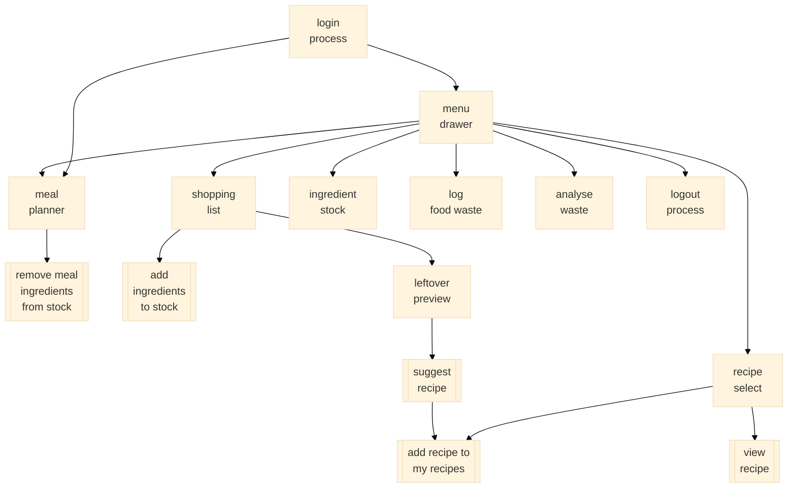

# food_manager

## application prototype goals
-	[X] Set up, understand flutter, create a framework for the application.
-	[X] Prove that an application framework can be written in flutter, and works on multiple devices.
-	[X] Prove that list / search interface style is possible. Recipe Search.
-   [ ] Prove that recipe drag and drop is possible for meal planner current UI design.
-   [X] Understand how styling is applied to flutter components
-   [ ] Understand if/how elements can be re-used in different places without duplication (for example recipe list, or recipe view)
-	[ ] Prove that the app can access JSON from a rest API (can be a public API for technical proof of concept, because Databases project will be deployed on server)
-   [ ] Prove that data can be passed from one screen to another, securely
-	[ ] Prove a test connection to firebase works (by reading and saving some data)

## Flutter Resources

- [Lab: Write your first Flutter app](https://docs.flutter.dev/get-started/codelab)
- [Cookbook: Useful Flutter samples](https://docs.flutter.dev/cookbook)
- [online documentation](https://docs.flutter.dev/)

# UML

# UI flow

    

# data structures

#