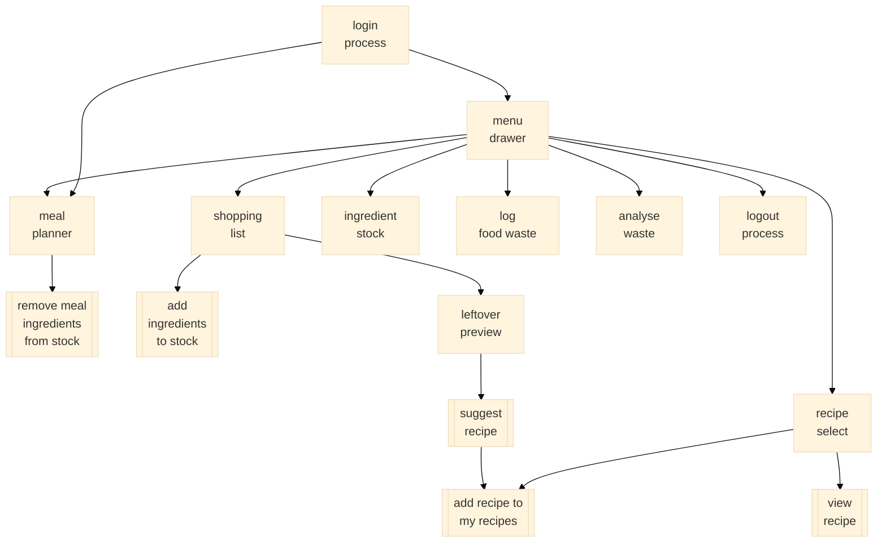

# food_manager

## Flutter Resources

- [Lab: Write your first Flutter app](https://docs.flutter.dev/get-started/codelab)
- [Cookbook: Useful Flutter samples](https://docs.flutter.dev/cookbook)
- [online documentation](https://docs.flutter.dev/)

# UML

# UI flow

    

# data structures

#