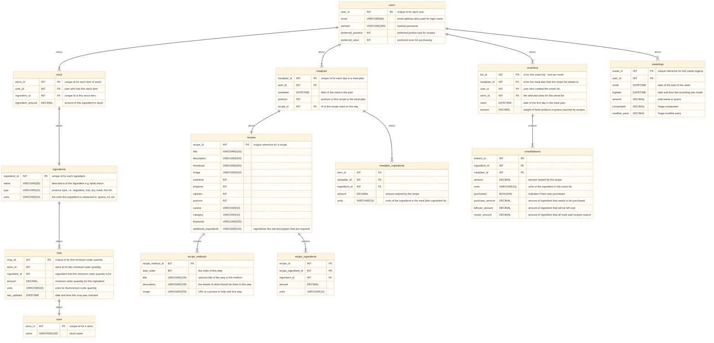

# food_manager

## application prototype goals
-	[X] Set up, understand flutter, create a framework for the application.
-	[X] Prove that an application framework can be written in flutter, and works on multiple devices.
-	[X] Prove that list / search interface style is possible. Recipe Search UI.
- [X] Understand how styling is applied to flutter components
- [X] Prove that recipe drag and drop is possible for meal planner current UI design.
- [X] Prove that data can be passed from one screen to another, securely (poc recipe to recipe view)
-	[ ] Prove a test connection to firebase works (by reading and saving some data)
-	[ ] Prove that the app can access JSON from a rest API (can be a public API for technical proof of concept, because Databases project will be deployed on server)

## Flutter Resources

- [Lab: Write your first Flutter app](https://docs.flutter.dev/get-started/codelab)
- [Cookbook: Useful Flutter samples](https://docs.flutter.dev/cookbook)
- [online documentation](https://docs.flutter.dev/)
- [flutter design material.dart tutorial - medium](https://medium.com/@flutter.rashpinder/flutters-the-material-app-widget-a-developer-s-guided-series-part-1-cded465e6e8e)
- [flutter design material.dart tutorial - geeksforgeeks](https://www.geeksforgeeks.org/flutter-material-design/)
- [flutter design material.dart guide and code labs - material.io](https://m2.material.io/develop/flutter)
- [research into flutter and firebase](https://codewithandrea.com/videos/starter-architecture-flutter-firebase/)
- [JSON to dart converter](https://quicktype.io/dart)
- [Dart to Plant/Mermaid](https://pub.dev/packages/dcdg)

## Android APK build process

For actual apk on device to see size etc. prototype is 49Mb.
`flutter build apk`
apk will be in `build/output/flutter-apk/`

development:
copy to drive and download from there.

# Requirements

# UI flow

## user application UI flow

## admin website UI flow

# data structures

## Class Diagrams

## Database Design SQL

