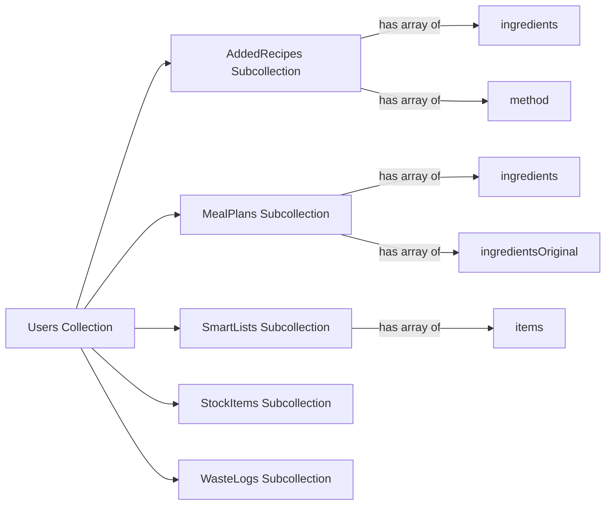
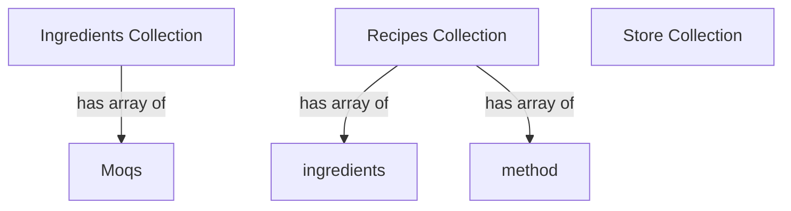

```mermaid
graph LR

  Users[Users Collection]

  Users --> AddedRecipes[AddedRecipes Subcollection]
  Users --> MealPlans[MealPlans Subcollection]
  Users --> SmartLists[SmartLists Subcollection]
  Users --> StockItems[StockItems Subcollection]
  Users --> WasteLogs[WasteLogs Subcollection]

  AddedRecipes -->|has array of| ARIngredients[ingredients]
  AddedRecipes -->|has array of| ARMethod[method]

  MealPlans -->|has array of| MealIngredients[ingredients]
  MealPlans -->|has array of| OriginalIngredients[ingredientsOriginal]

  SmartLists -->|has array of| ListItems[items]
```

```mermaid
graph TD

  Ingredients[Ingredients Collection]
  Recipes[Recipes Collection]
  Store[Store Collection]

  Ingredients -->|has array of| Moqs[Moqs]

  Recipes -->|has array of| IngredientsInRecipe[ingredients]
  Recipes -->|has array of| MethodSteps[method]


```